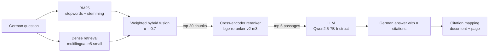

# Deutscher Enterprise Knowledge Copilot

**A German question-answering assistant for hospital IT documentation.** An employee asks a question in German and gets an answer that is generated only from the internal handbooks, with a clickable citation (document + page) for every statement, a confidence indicator, and an explicit "I don't know" when the documents don't contain the answer.

🔗 **Live demo:** [huggingface.co/spaces/Areftawana3/Knowledge-Assistant](https://huggingface.co/spaces/Areftawana3/Knowledge-Assistant) (runs on ZeroGPU)

| | |
|---|---|
| **End-to-end correct answers** | **83.8 %** of 130 answerable test questions (95 % CI 77–90 %) |
| **Unanswerable questions refused** | **12 / 12** (no hallucinated answers) |
| **Retrieval Recall@5** | **0.949** (hybrid search + cross-encoder reranking) |
| **Answers with a citation** | 100 %, of which 96 % cite a labelled correct page |
| **Latency** | ≈ 4 s per question (0.7 s retrieval + 3 s generation on ZeroGPU) |

All documents are **synthetic** (fictional *Klinikum Musterstadt*). No real hospital or patient data is used.

---

## Architecture



1. **Ingestion:** 12 PDF handbooks → text extraction per page (`pypdf`) → cleaning (German hyphenation at line breaks) → sentence-based chunks of ≤ 60 words with one sentence of overlap. Every chunk keeps its `document#page` ID, so citations stay traceable.
2. **Retrieval:** BM25 (implemented from scratch) and a multilingual embedding model are fused with a weighted score combination. Each chunk is indexed with a *contextual header* (document + section title).
3. **Reranking:** a multilingual cross-encoder reads question and chunk *together* and re-sorts the top 20.
4. **Generation:** the top 5 passages are numbered `[1]…[5]` in the prompt. The LLM must answer only from them, cite every statement, and reply with a fixed sentence if the answer is not there.
5. **Citations:** `[n]` is mapped back to `document + page`. In the demo, each source opens the PDF at the cited page.

---

## Data

| | |
|---|---|
| Documents | 12 German IT handbooks (KIS, PACS, LIS, RIS, DMS, Dienstplan, E-Mail, VPN, Netzlaufwerke, SAP, Servicedesk, IT-Sicherheit) |
| Content pages / chunks | 120 pages → 136 chunks |
| Test questions | **142**: 38 close wording, 44 paraphrase, 38 colloquial, 10 multi-page (graded relevance), **12 unanswerable** |
| Dev questions | 120 (used only to tune the fusion weight α) |
| Random baseline | Recall@10 ≈ 8 % (so high scores are meaningful) |

Ten system handbooks deliberately share one page structure (access requests, password reset, outage procedures …), producing **near-duplicate distractor pages**: to answer "Wer genehmigt den PACS-Zugang?", the retriever must pick the PACS page out of ten almost identical access pages.

---

## Results

All retrieval metrics are on the 130 answerable test questions, page-level, with duplicate chunks of the same page counted once.

### 1. Keyword retrieval: what each BM25 component contributes

| BM25 variant | Recall@5 | Recall@10 | MRR@10 | nDCG@10 |
|---|---|---|---|---|
| basic tokenizer | 0.546 | 0.703 | 0.373 | 0.445 |
| + stopwords | 0.627 | 0.735 | 0.506 | 0.552 |
| + Snowball stemming | 0.689 | 0.773 | 0.536 | 0.588 |
| **+ contextual header** | **0.760** | **0.849** | **0.640** | **0.683** |

### 2. Dense vs. keyword retrieval

| Retriever | Recall@5 | Recall@10 | MRR@10 | nDCG@10 |
|---|---|---|---|---|
| BM25 (best) | 0.760 | 0.849 | 0.640 | 0.683 |
| e5-small, no query/passage prefixes | 0.823 | 0.923 | 0.650 | 0.708 |
| e5-small | 0.835 | 0.933 | 0.677 | 0.731 |
| **e5-small + contextual header** | **0.879** | **0.956** | **0.785** | **0.821** |

Recall@5 by question type shows *where* each method fails:

| | close | paraphrase | colloquial | multi-page |
|---|---|---|---|---|
| BM25 | 1.000 | 0.693 | 0.684 | 0.433 |
| Dense + header | 1.000 | 0.852 | 0.868 | 0.583 |

### 3. Hybrid fusion

| Method | Recall@5 | Recall@10 | MRR@10 | nDCG@10 |
|---|---|---|---|---|
| Dense + header | 0.879 | 0.956 | 0.785 | 0.821 |
| Reciprocal Rank Fusion (k = 60) | 0.831 | 0.917 | 0.745 | 0.782 |
| **Weighted fusion (α = 0.7, tuned on dev)** | 0.873 | 0.955 | **0.802** | **0.831** |

### 4. Reranker comparison (first stage: weighted hybrid; NVIDIA T4)

| Setting | Recall@5 | Recall@10 | MRR@10 | nDCG@10 | ms / query |
|---|---|---|---|---|---|
| No reranker | 0.873 | 0.955 | 0.802 | 0.831 | 12 |
| mMiniLM (118M), pool 10 | 0.879 | 0.955 | 0.807 | 0.836 | 36 |
| mMiniLM (118M), pool 20 | 0.868 | 0.964 | 0.797 | 0.829 | 57 |
| bge-reranker-v2-m3 (568M), pool 10 | 0.941 | 0.955 | 0.887 | 0.894 | 258 |
| **bge-reranker-v2-m3 (568M), pool 20** | **0.949** | **0.967** | **0.892** | **0.899** | 536 |
| bge-reranker-v2-m3 (568M), pool 30 | 0.949 | 0.972 | 0.892 | 0.900 | 791 |

The large reranker lifts colloquial questions from 0.868 to **1.000** Recall@5 (10 questions gained, 0 lost). The retrieval ceiling (a relevant page in the top 20 chunks) is 0.985, so pool 30 adds cost without gain.

### 5. End-to-end RAG evaluation (Qwen2.5-7B-Instruct, 142 test questions)

Values: mean [95 % bootstrap confidence interval, 2,000 resamples].

| Aspect | Result |
|---|---|
| Unanswerable questions correctly refused | **1.000** (12 / 12) |
| Answerable questions wrongly refused | 0.046 [0.015, 0.085] |
| Answers with ≥ 1 citation | 1.000 |
| Answer cites a labelled page | 0.960 [0.919, 0.992] |
| Sentences carrying a citation | 0.800 [0.753, 0.851] |
| Invalid citation numbers | 0 |
| **Fully faithful** (every claim supported by the passages) | **0.903** [0.847, 0.952] |
| Citation support: full / partial / none | 0.927 / 0.073 / 0.000 |
| Correctness: correct / partially correct / incorrect | 0.879 / 0.121 / **0.000** |
| Relevance (1–3) | 2.90 |
| **End-to-end correct** (all 130 answerable; a refusal counts as not correct) | **0.838** [0.769, 0.900] |

End-to-end correctness by question type: close 1.000 · paraphrase 0.818 · colloquial 0.789 · multi-page 0.500.

**The reranker score as a confidence signal:**

| Top reranker score | n | End-to-end correct |
|---|---|---|
| ≥ 0.5 | 92 | 0.913 |
| 0.1 – 0.5 | 18 | 0.611 |
| < 0.1 | 20 | 0.700 |
| *unanswerable questions* | 12 | all scores 0.00 |

The demo shows this score as "Retrieval confidence" and asks the user to check the source when it is below 0.5.

### 6. Validating the LLM judge against human grades

Faithfulness, citation support, correctness and relevance were graded by an **LLM judge** (Qwen2.5-14B-Instruct, 4-bit), which saw the question, the passages, the answer and the labelled reference page. To check the judge, 20 random answers were graded by hand without looking at the judge's verdict:

| | |
|---|---|
| Agreement (3 levels: correct / partially correct / incorrect) | **90 %** (18 / 20) |
| Disagreements | 2, in both cases the human grade was **stricter** |

So the judge is usable, but probably slightly lenient: the true end-to-end correctness may be a little below 83.8 %.

---

## Design decisions (and what the data said)

- **Build the measuring stick first.** Metrics (Recall@k, MRR, nDCG) are implemented from scratch and verified on a hand-computed example before any retriever exists.
- **No leakage between train and test questions.** Question *templates* 0–1 are test-only and 2–3 train-only. Different IDs alone would let a model learn the sentence patterns.
- **Contextual headers** (document + section title in front of each chunk) were the single biggest improvement for both BM25 (+10 MRR points) and dense retrieval (+11). Chunks like "Nach der Genehmigung ist der Zugang … freigeschaltet" otherwise don't say *which* system they belong to.
- **Hyperparameters are tuned on a dev set, never on the test set.** The fusion weight α was chosen on the 120 dev questions (best: 0.7). Test agreed closely (best 0.8, difference 0.007), so the reported score is not inflated.
- **RRF is not a free lunch.** It weights both retrievers equally, and with a much weaker BM25 it lost 12 questions that dense retrieval found. A weighted mix that down-weights the weaker retriever is better here.
- **Bigger reranker, measured trade-off.** The small multilingual reranker gave no gain (7 questions gained, 7 lost), since it is trained on machine-translated web queries and weak on colloquial German ("KIS geht nicht"). The large one gained 10 and lost 0. Accuracy was the priority, so the large one is used.
- **Numbered passages for citations.** The LLM only writes `[n]`, and the program maps it to document + page. The model never has to copy a file name or page number, so it cannot invent a source.
- **A fixed refusal sentence** makes refusals machine-detectable, and therefore measurable.
- **Greedy decoding** for reproducible answers.
- **Reproducibility:** chunk order is sorted by file name, because Windows and Linux sort paths differently. That had caused tie-breaking differences of up to 0.008 in the metrics.
- **Error analysis over averages.** Keyword search fails in two opposite ways: *different words, same meaning* ("gespeichert … ansieht" vs. "protokolliert"), which dense retrieval fixes; and *same word, different meaning* ("gesperrt" as in account vs. session), which even the reranker only partly fixes.
- **ZeroGPU deployment:** models are loaded at startup and moved with `.to("cuda")`, but **nothing is computed at startup**. Running the embedding model at startup (to index the chunks) broke ZeroGPU's GPU worker. This was found by bisection (adding one component at a time) and fixed by indexing lazily on the first question, inside the `@spaces.GPU` function.

---

## Limitations

- **Minimal synthetic documents.** One short section per page, no headers/footers, tables or printed page numbers, and no sections spanning page breaks. Real enterprise PDFs are noisier, so the scores here are likely **optimistic**. Handling realistic document layouts is the subject of a follow-up project.
- **Templated pages and questions.** Ten handbooks share one structure, and many questions come from templates. This creates realistic distractors, but less linguistic variety than real users produce.
- **Incomplete relevance labels.** Some unlabelled pages are also relevant (e.g. general password rules for "KIS Passwort vergessen"), which penalises reasonable answers. Several "failures" in the error analysis are label problems rather than model errors.
- **Small test set.** 130 answerable and 12 unanswerable questions give confidence intervals of about ±6 points. Differences of one or two questions between systems are noise.
- **LLM judge:** same model family as the answering model (self-preference risk), validated on only 20 human-graded answers.
- **Confidence threshold not tuned.** All unanswerable questions are in the test set, so no refusal threshold was fitted. The reranker score is shown as information only.
- **Multi-page questions are the weak spot** (50 % end-to-end correct on 10 questions): they need several pages in the top 5 *and* the LLM must combine them.
- **Latency** was measured on different hardware (laptop CPU, Kaggle T4, ZeroGPU), so it is comparable only within each table.

---

## Repository structure

```
data/
  build_corpus.py        12 synthetic PDF handbooks + labelled questions
  docs/*.pdf             the handbooks
  pages.jsonl            ground-truth page texts (used to validate extraction)
  questions.jsonl        262 questions with graded relevance labels, train/test split
  chunks.jsonl           136 searchable chunks
src/
  ingest.py              PDF extraction, cleaning, sentence-based chunking
  bm25.py                BM25 from scratch, configurable German tokenizer
  dense.py               embedding retrieval (sentence-transformers)
  hybrid.py              RRF and weighted score fusion
  rerank.py              cross-encoder reranking
  generate.py            grounded prompt, citation parsing, LLM loading
  pipeline.py            the complete RAG pipeline (used by evaluation AND demo)
eval/
  metrics.py             Recall@k, MRR, nDCG (from scratch)
  evaluate_retrieval.py  BM25 vs dense vs hybrid
  evaluate_rerank.py     reranker comparison
  generate_answers.py    run the RAG pipeline on all test questions
  judge_answers.py       LLM-as-a-judge
  report.py              evaluation report with bootstrap CIs and human-agreement check
results/
  answers_*.jsonl        all generated answers
  judged_*.jsonl         judge verdicts
  human_check_*.csv      manual grades for judge validation
space/
  app.py                 Gradio demo for Hugging Face ZeroGPU
  deploy.py              uploads exactly the files the demo needs
```

## Reproduce

```bash
git clone https://github.com/AT3060/Knowledge-Assistant.git
cd Knowledge-Assistant
python -m venv .venv && source .venv/Scripts/activate      # Windows Git Bash; on Linux/Mac: .venv/bin/activate
pip install -r requirements.txt

python data/build_corpus.py              # PDFs + questions
python src/ingest.py                     # chunks (validated against pages.jsonl)
python eval/evaluate_retrieval.py        # BM25 / dense / hybrid tables (CPU is enough)
```

GPU steps (e.g. on Kaggle with 2× T4; `pip install accelerate bitsandbytes`):

```bash
python eval/evaluate_rerank.py --models small,large
python eval/generate_answers.py --model Qwen/Qwen2.5-7B-Instruct
python eval/judge_answers.py --answers results/answers_Qwen2.5-7B-Instruct.jsonl
python eval/report.py --model Qwen2.5-7B-Instruct        # runs on CPU
```

Deploy the demo (needs a Hugging Face write token in `HF_TOKEN`):

```bash
python space/deploy.py --repo <user>/<space-name>
```

## Tech stack

Python · PyTorch · sentence-transformers · Hugging Face Transformers · bitsandbytes (4-bit) · pypdf · reportlab · Snowball stemmer · NumPy · Gradio · Hugging Face Spaces (ZeroGPU) · Kaggle GPUs

**Models:** `intfloat/multilingual-e5-small` · `BAAI/bge-reranker-v2-m3` · `cross-encoder/mmarco-mMiniLMv2-L12-H384-v1` · `Qwen/Qwen2.5-7B-Instruct` · `Qwen/Qwen2.5-14B-Instruct` (judge)
